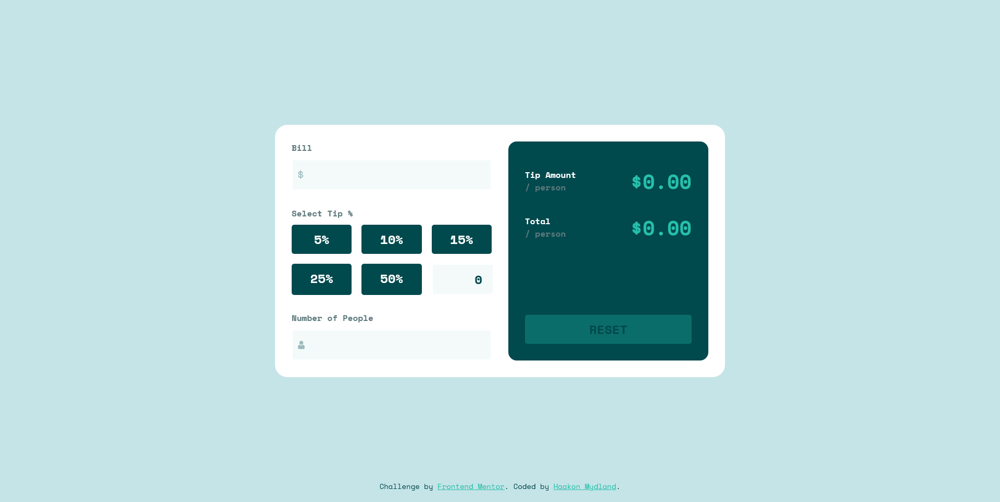
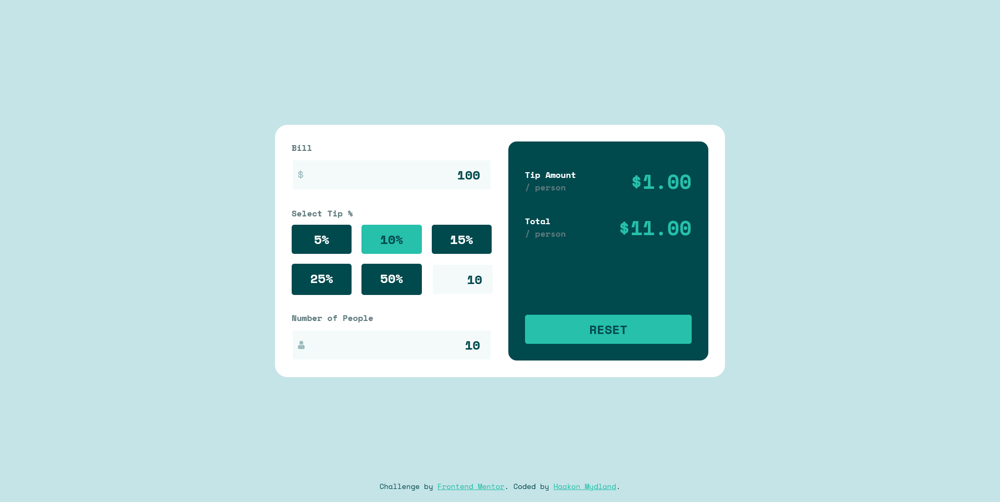
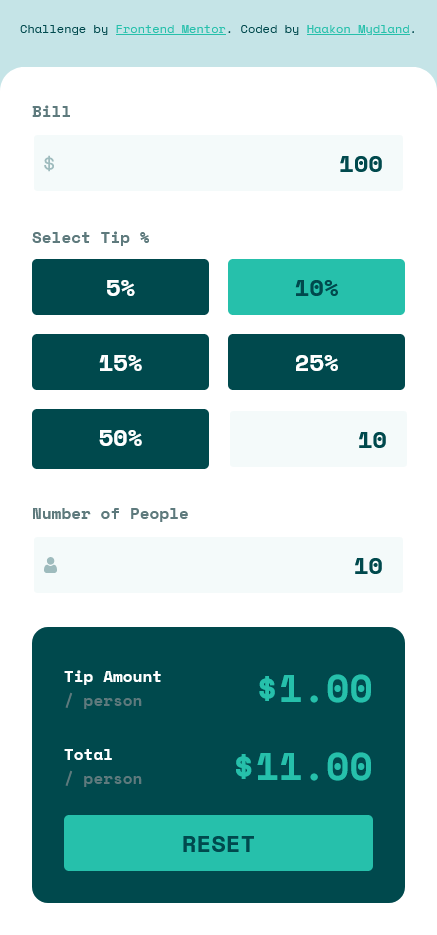

# Frontend Mentor - Tip calculator app solution

This is a solution to the [Tip calculator app challenge on Frontend Mentor](https://www.frontendmentor.io/challenges/tip-calculator-app-ugJNGbJUX). Frontend Mentor challenges help you improve your coding skills by building realistic projects.

## Table of contents

- [Overview](#overview)
  - [The challenge](#the-challenge)
  - [Screenshot](#screenshot)
  - [Links](#links)
- [My process](#my-process)
  - [Built with](#built-with)
  - [What I learned](#what-i-learned)
- [Author](#author)

## Overview

### The challenge

Users should be able to:

- View the optimal layout for the app depending on their device's screen size
- See hover states for all interactive elements on the page
- Calculate the correct tip and total cost of the bill per person

### Screenshot





### Links

- Solution URL: [frontendmentor.io](https://www.frontendmentor.io/solutions/tip-calculator-app-react-typescript-zTr5ZR2wYc)
- Live Site URL: [tip-calculator-app-myd.pages.dev](https://tip-calculator-app-myd.pages.dev/)

## My process

### Built with

- Semantic HTML5 markup
- CSS custom properties
- Flexbox
- CSS Grid
- Mobile-first workflow
- [TypeScript](https://www.typescriptlang.org/)
- [React](https://reactjs.org/) - JS library

### What I learned

For this project I wanted to add a few extra functionalities. It is built using react and typescript. All values are stored and displayed as states to make it as quick as possible.

I decided I did not want to add any validation messages, and instead opted to make it impossible to input values that would lead to a validation fail.

This function executes on input on any of the input fields. It first replaces any non number value so that only numbers can be input. (see further explanation bellow)

```ts
function handleInput(e: any) {
    let target = e.target;
    onlyNumber(target);
    setInputs((prev: any) => {
      prev[target.parentElement.id] = parseInt(target.value);
      if (target.parentElement.id == "people" && parseInt(target.value) == 0) {
        prev[target.parentElement.id] = parseInt("");
      }

      return prev;
    });
```

Then it adds the input value to a state. Lastly it makes sure that the people input can not be 0.

The only numbers function looks like this.

```ts
export function onlyNumber(target: any) {
  target.value = target.value
    .replace(/[^0-9.]/g, "")
    .replace(/(\..*?)\..*/g, "$1");
}
```

Whenever the inputs change it updates the state, and then updates the states of the results. The results are a quick math equation based on the inputs.

```ts
useEffect(() => {
  setResults((prev: any) => {
    let tipAmount = (parseInt(Inputs.bill) / 100) * parseInt(Inputs.tip);
    let total = parseInt(Inputs.bill) + tipAmount;
    return {
      tip: tipAmount / parseInt(Inputs.people),
      total: total / parseInt(Inputs.people),
    };
  });
}, [Inputs]);
```

## Author

- Website - [Haakon Mydland](https://www.haakonmydland.com/home)
- Frontend Mentor - [@haakonmydland](https://www.frontendmentor.io/profile/haakonmydland)
- Twitter - [@haakonmydland](https://www.twitter.com/haakonmydland)
